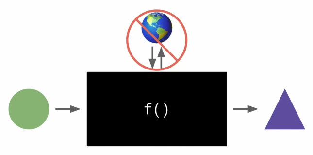

# Functional Javascript 1

## What is functional programming?

> a programming paradigm 一种编程范式

- Imperative 指令式
  - follow my commands do this, then chat
  - 跟我指令做这个，然后做那个
- Declarative 声明式
  - this is what I want do it however you want
- Object-Oriented
  - keep state to yourself, send/receive message

prue functions

- only input in
- only output out



## Pure vs Impure functions

- Not pure:

```js
let name = "Jerry";

function greet() {
  console.log("Hello, ${name}!")
}

greet();  // -> Hello, Jerry!

name = "Alan";
greet();  // -> Hello, Alan!
```

- Pure:

```js
function greet(name) {
  return `Hello, ${name}!`;
}

greet("Jerry");  // -> Hello, Jerry!

greet("Alan");  // -> Hello, Jerry!
```

## Why functional programming?

> **more predictable, safer**

> **easier to test/debug**

> ~~is The Best™ paradigm, makes you look smart~~

## Side Effects
