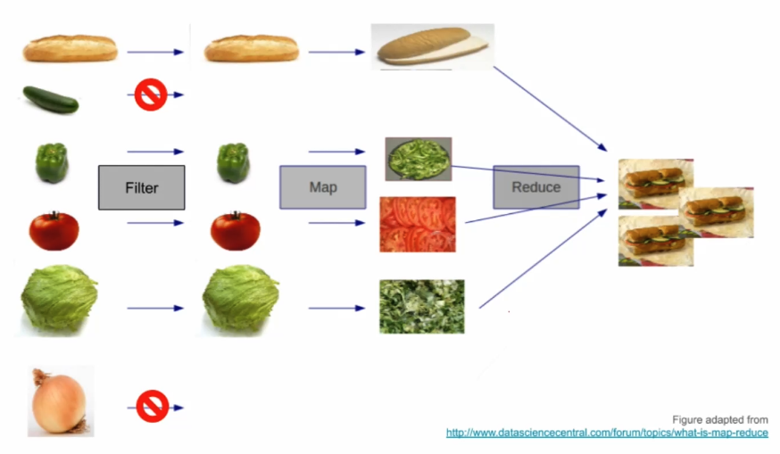

# Functional Javascript 1

## What is functional programming?

> a programming paradigm 一种编程范式

- Imperative 指令式
  - follow my commands do this, then chat
  - 跟我指令做这个，然后做那个
- Declarative 声明式
  - this is what I want do it however you want
- Object-Oriented
  - keep state to yourself, send/receive message

prue functions

- only input in
- only output out


## Pure vs Impure functions

- Not pure:

```js
let name = "Jerry";

function greet() {
  console.log("Hello, ${name}!")
}

greet();  // -> Hello, Jerry!

name = "Alan";
greet();  // -> Hello, Alan!
```

- Pure:

```js
function greet(name) {
  return `Hello, ${name}!`;
}

greet("Jerry");  // -> Hello, Jerry!

greet("Alan");  // -> Hello, Jerry!
```

## Why functional programming?

> **more predictable, safer**
>
> **easier to test/debug**
>
> ~~is The Best™ paradigm, makes you look smart~~

## Side Effects

- Avoid side effects 避免副作用
  - do nothing but return output
  - based on nothing but input

```js
let thesis = { name: "Jerry", date: 2000 };

function renameThesis(newName) {
  thesis.name = newName;
  console.log("Renamed!");
}

renameThesis("Re-Jerry"); // -> Renamed!
thesis; // {name: "Re-Jerry", date: 2000}
```

> "不要暗箱操作"！！！ 也就 `js` 的特性能引用传递，其他的都是值传递了。

```js
// ---- No Side Effects ----
let thesis = { name: "Jerry", date: 2000 };

function renameThesis(oldThesis, newName) {
  return {
    name: newName, date: oldThesis.date
  }
}

const thesis2 = renameThesis("Re-Jerry"); // -> Renamed!
thesis; // {name: "Re-Jerry", date: 2000}
thesis2; // {name: "Jerry", date: 2000}
```

- 传原始对象进去
- 返回一个新的对象，不去动原来的对象

- [做下练习题](https://observablehq.com/@anjana/exercise-pure-functions?collection=@anjana/functional-javascript-first-steps)

## Recursion

> Staying out of the loop with recurion.

- Iteration 迭代
  - imperative
  - looping
  - stateful
- Recursion 递归
  - functional
  - self-referential 咋理解呢？自我呼应是啥？应该是只所有依赖均在自己作用域内，不依赖外部变量。
  - stateless

> 真是说到核心了，迭代是stateful，递归是stateless。

- Iteration isn't functional
  - use recursion instead 请用递归替代吧

```js
// Iteration
function sum(numbers) {
  let total = 0; // this is a state!
  for (i = 0; i < numbers.length; i++) {
    total += numbers[i];
  }
  return total;
}

sum([0,1,2,3,4]) // -> 10
```

```js
// Recursion
function sum(numbers) {
  if (numbers.length === 1) {
    // base case
    return numbers[0];
  } else {
    // recursive case
    return numbers[0] + sum(numbers.slice(1))
  }
}

const numbers = [0,1,2,3,4];

sum(numbers); // -> 10

// 说真的，reduce 还是挺好用。
// 但 sum 算是一个 state 了？
const newSum = numbers.reduce((sum,cur) => sum += cur, 0);
```

- [来嘛，再做下练习](https://observablehq.com/@anjana/functional-javascript-first-steps?collection=%40anjana%2Ffunctional-javascript-first-steps)

## Iteration vs. Recursion

> In functional programming, we avoid mutable state, and therefore aviod iterative loops using `for` or `while`. As an alternative to iteration, we use `recursion` to break down the problem into smaller ones.
>
> 在函数式编程中，我们应该避免去改变状态，而且也要避免使用迭代循环中的 `for` 和 `while`，在去替换迭代的算法时，我们应该使用递归的思想：把问题分解成更小份。

原来一个递归函数包含这两部分：

- Base case: condition(s) under which the function returns an output without making a recursive call
- 基本情况：当前条件下，不需要去调用自身递归函数，就可以得到输出
- 其实这就是递归的终止情况了，递归到此完结了
- Recursive case: condition(s) under which the function calls itself to return the output

## high order function

- First-class functions
  - can be passed around as values (like callbacks)
- higher-order functions
  - take ohter functions
  - as input/output
- **Remember: Don't loop** （被循环）
  - use higher-order functions like map,reduce, filter **instead**



> 👆👆 灵魂配图师 👆👆

### 高阶函数-Filter

> The filter function takes a "predicate" function (a function that takes in a value and returns a boolean) and an array, applies the predicate function to each value in the array, and returns a new array with only those values for which the predicate function returns true.
>
> filter 函数使用 `predicate` 函数和原数据作为输入参数！

```js
function filter(predicateFn, array) {
  if (length(array) === 0) return [];
  const firstItem = head(array);
  const filteredFirst = predicateFn(firstItem) ? [firstItem] : [];
  return concat(filteredFirst, filter(predicateFn, tail(array)));
}
```

### Challenge: Mapping Fizz Buzz

```js
// -> 我的 😂
fizzBuzz = map(n => {
  if (n === 0) return "fizzbuzz";
  if (n % 3 === 0 && n % 5 === 0) return "fizzbuzz";
  if (n % 3 === 0) return "fizz";
  if (n % 5 === 0) return "buzz";
  return n;
}, wholes)
```

```js
// -> 作者的 🚀
const fizzBuzz = map(n => {
  const fizzed = n % 3 === 0 ? 'fizz' : '';
  const buzzed = n % 5 === 0 ? 'buzz' : '';
  return fizzed || buzzed ? fizzed + buzzed : n;
}, wholes)
```

> 大意了，求余的操作结果可以留着用！

## Closure

- Functions can defin functions
  - return inner function
  - and it will "remeber" scope

```js
function makeAdjectifier(adjective) {
  return function(noun) {
    return adjective + " " + noum;
  }
}

const coolfiy = makeAdjectifier("cool");
coolfiy("workshop");  // -> "cool workshop"
coolfiy("drink");     // -> "cool drink"
```

- This lets us "Partially Applied Function"
  - to "lock in" some arguments
  - and make more reusable functions

> 以上案例告诉我们，可以使用“部分调用”的函数 去锁定一些参数和制作更多可复用的函数

在函数式编程语言中，调用函数的过程也叫做将函数应用(applying)到参数。当调用时传入了所有的参数，就叫做将函数完全应用(fully applied)到了所有参数。如果在调用时只传入了部分参数，返回的结果就是一个部分应用函数(Partially Applied Function)。当只传入部分参数时，Scala并不会报错，而是简单地应用(apply)了这些参数，并返回一个接受剩余参数的新函数。

```scala
val divide = (num: Double, den: Double) => {
 num / den
}

val halfOf: (Double) => Double = divide(_, 2)

halfOf 20 shouldEqual 10
```

- https://zhuanlan.zhihu.com/p/33165576
